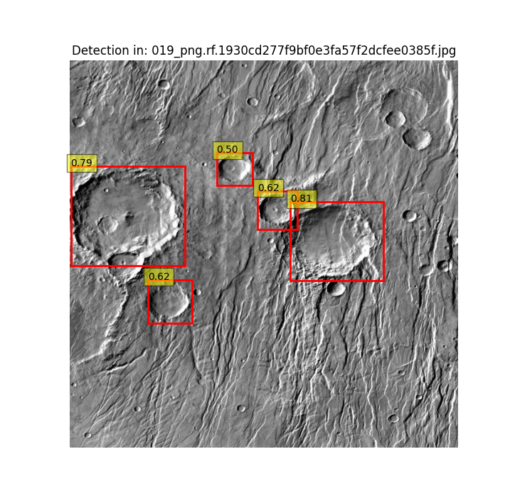
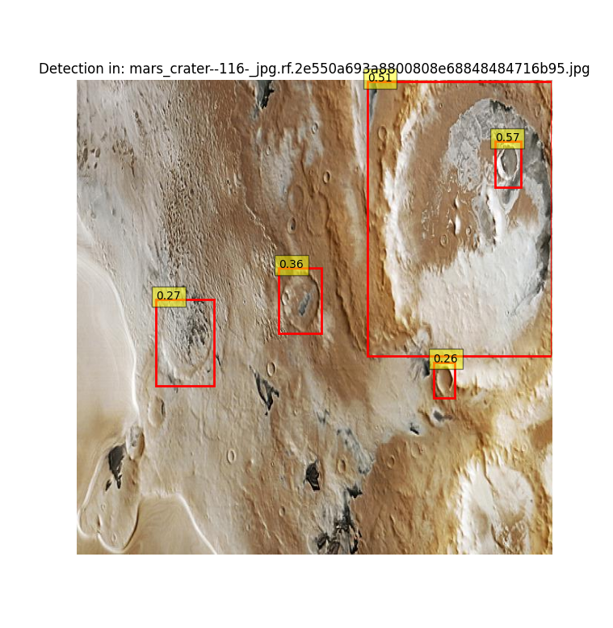
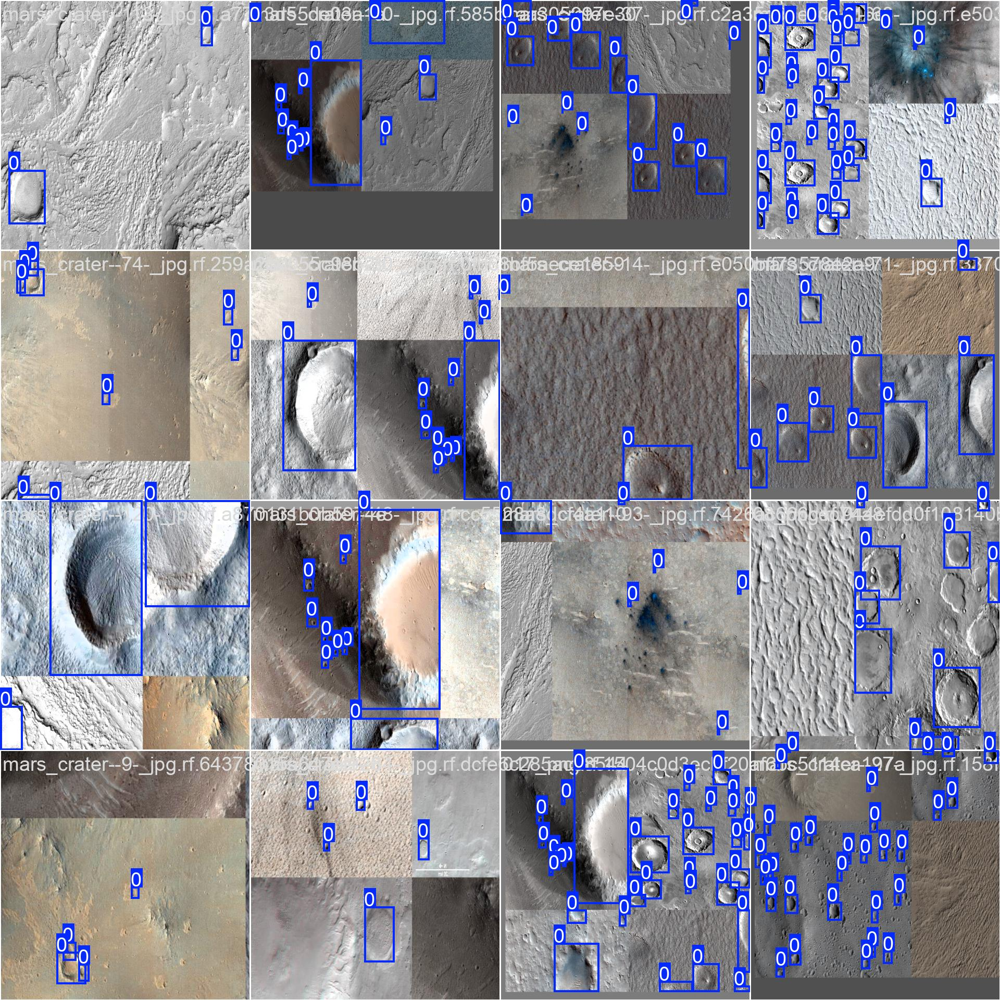

# mars-crater-detection
Implementing YOLO8 to detect craters on Mars

<div style="display: flex; justify-content: space-between;">
    
    
</div>

## How to Use

1. Clone the repository:
   ```bash
   git clone https://github.com/TristanLecourtois/mars-crater-detection.git

2. Navigate to the repository:
 ```bash
   cd mars-crater-detection
```

3. Run the different files to preprocess data and visualize sample detections:
```bash
python preprocess.py
python eval.py
```


